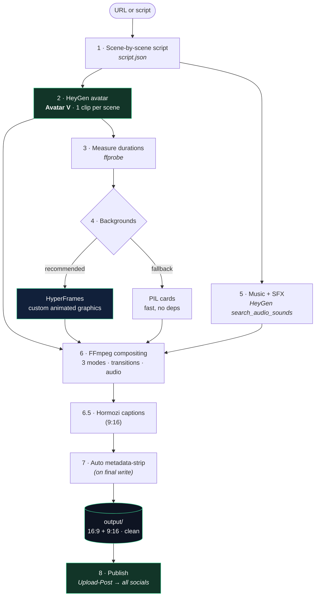
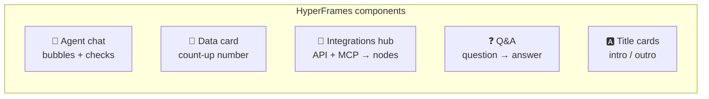
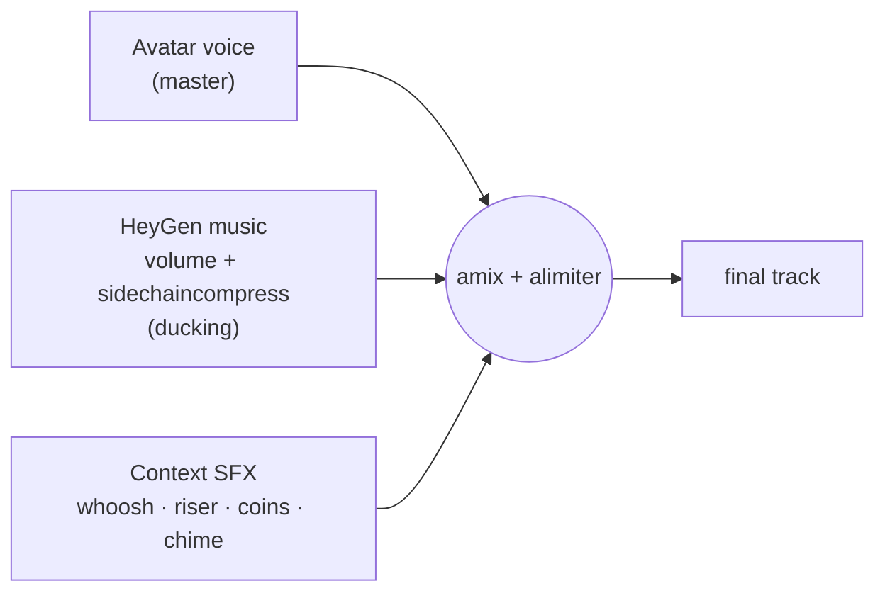
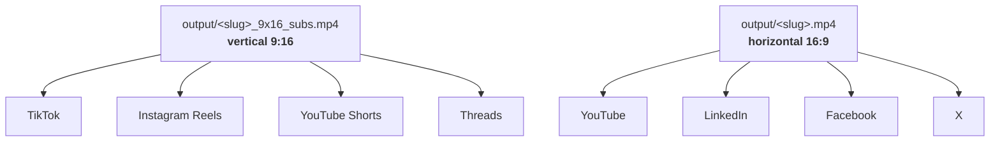

<div align="center">

# 🎬 avatar-mix

**Generate vertical & horizontal videos with your HeyGen avatar, custom animated backgrounds, music, context-aware SFX, and Hormozi-style captions — from a single URL or script.**

`HeyGen (Avatar V)` · `HyperFrames` · `FFmpeg` · `TTS word-timing` · `Upload-Post`

</div>

---

## ✨ What it does

From **a URL** (website/product) or **a script**, it produces a video where **your avatar presents** the content, with a **dynamic edit** that alternates between 3 layout modes, **custom-built animated graphics** (not website screenshots), **music with ducking**, **sound effects chosen to match the content**, and **animated captions** for social — in **16:9 and 9:16** from the same avatar clips.

> Built as a **reusable skill**: for the next video you only need a URL or a script.

---

## 🎥 See it in action

This demo is **100% generated by the pipeline** — script, avatar, animated backgrounds, music, SFX and captions. Previews loop below; **click for the full video with sound** 🔊

| 16:9 — YouTube / LinkedIn | 9:16 + captions — Reels / TikTok / Shorts |
|:---:|:---:|
| [](https://github.com/Upload-Post/avatar-mix/releases/download/v0.1.0/skilldemo_en.mp4) | [](https://github.com/Upload-Post/avatar-mix/releases/download/v0.1.0/skilldemo_en_9x16_subs.mp4) |
| ▶️ [Watch full 16:9 (with audio)](https://github.com/Upload-Post/avatar-mix/releases/download/v0.1.0/skilldemo_en.mp4) | ▶️ [Watch full 9:16 (with audio)](https://github.com/Upload-Post/avatar-mix/releases/download/v0.1.0/skilldemo_en_9x16_subs.mp4) |

---

## 📋 What you need

| Requirement | Details |
|-------------|---------|
| **HeyGen account** | Plan **Creator** ($29/mo, 600 credits ≈ ~30 one-min videos). The free plan can't do multiple scenes or TTS. |
| **A HeyGen avatar + voice** | A **digital-twin avatar** (your face) and a **voice** (cloned or native). Get their IDs with `list_avatar_looks` / `list_voices`. |
| **HeyGen access** | The **HeyGen MCP** (OAuth, `/mcp`) — or a `HEYGEN_API_KEY` in `.env`. |
| **Upload-Post account** *(to publish)* | An **`UPLOAD_POST_API_KEY`** (<https://app.upload-post.com> → Settings → API) and a profile with your socials connected (TikTok, Instagram, YouTube, LinkedIn, Threads…). |
| **System** | **FFmpeg**, **Node ≥22** (HyperFrames runs headless Chrome), **Python 3 + Pillow**. |
| **An AI agent** *(optional)* | Drive the skill conversationally (e.g. Claude Code) — or run the scripts directly. |

> Credits: **only avatar generation costs HeyGen credits** (~20/min). Backgrounds, audio, captions, compositing and metadata-strip are local & free.

---

## 🔭 Workflow (overview)



**Only step 2 (avatar) costs credits.** Backgrounds, audio, captions and compositing are local/free.

---

## 🎞️ The 3 scene modes

The edit alternates between these modes (always starts on `fullscreen`), with transitions:

| Mode | 16:9 | 9:16 | What you see |
|------|------|------|--------------|
| **`fullscreen`** | avatar full screen | avatar (cover) | Just you |
| **`corner`** | background + avatar PiP **bottom-right** | background + avatar PiP **bottom-center, large** | Graphic + you |
| **`bg_only`** | background only | background only | Graphic; your voice as voice-over |

```
 fullscreen          corner (16:9)         bg_only
┌───────────┐       ┌───────────┐        ┌───────────┐
│           │       │ GRAPHIC   │        │ ANIMATED  │
│    🧑      │  ⇄    │       ┌──┐│   ⇄    │ GRAPHIC   │
│           │       │       │🧑││        │           │
└───────────┘       └───────┴──┘┘        └───────────┘
```

> **PiP = "webcam" box** showing the avatar with its own background (no chroma-key). HeyGen doesn't offer transparent backgrounds for custom avatars, so the background is kept: it reads like a presenter over the slide.

---

## 🧩 Backgrounds: custom graphics, not screenshots

**Golden rule:** backgrounds are **explanatory animated graphics** built with HyperFrames (headless Chrome → MP4). Real website captures (`hyperframes capture`) only **occasionally**.

Reference components (see `work/<slug>/hf/index.html`):



Brand look: background `#0b0f1a`, accent `#3ddc97`, drifting glows, animated entrances, subtle pan/zoom.

> **Always-fresh registry:** on every HyperFrames render the skill auto-pulls the latest animations
> from the HyperFrames registry (`scripts/sync_animations.py`), so newly released ones (e.g. the 9
> code animations — `code-typing`, `code-diff`, `code-morph`, `code-particle-assemble`…) are
> available as `compositions/*.html` with no manual step. Great for **code / dev explainer** videos.

---

## 🗂️ Architecture

```
avatar-mix/
├── .claude/skills/avatar-mix/SKILL.md   # 🧠 orchestration (the brain of the flow)
├── config/avatar.json                   # avatar_id, voice_id, brand, PiP (16:9 & 9:16)
├── templates/
│   ├── composition.html                 # HyperFrames template (data-driven)
│   └── script.example.json              # script schema
├── scripts/
│   ├── make_bg.py        # backgrounds: --mode hyperframes | card · --aspect 16:9|9:16
│   ├── sync_animations.py # pull latest HyperFrames animations from the registry each run
│   ├── composite.py      # FFmpeg edit: 3 modes + xfade + audio (music+SFX+ducking)
│   ├── make_captions.py  # build Hormozi captions composition (transparent HyperFrames)
│   ├── burn_captions.py  # render + overlay captions → clean _subs.mp4
│   ├── strip_meta.sh     # strip metadata (used internally; also for external files)
│   ├── publish.sh        # publish a local file to socials via Upload-Post API
│   └── run.sh            # deterministic shortcut (measure → bg → edit · 16:9/9:16/both)
├── assets/                # music.wav + sfx/ (whoosh, pop, riser, coins, chime…)
├── work/<slug>/           # per-video (see below)
└── output/                # final MP4s — already metadata-free, ready to publish
```

**Per video** (`work/<slug>/`):

```
script.json          script + per-scene durations
clips/avatar_<id>.mp4   avatar clips (HeyGen Avatar V)
hf/  ·  hf_9x16/      HyperFrames projects (16:9 and vertical)
hf_captions/         caption composition (transparent)
captions_src.json    per-scene word timestamps (from create_speech)
sfx_manifest.json    placement of context-aware SFX
bg/  ·  bg_9x16/      backgrounds sliced per scene
```

---

## 🚀 Setup (once)

1. **Connect the HeyGen MCP** (`/mcp` → authenticate) or use `HEYGEN_API_KEY` in `.env`.
2. **Copy `config/avatar.example.json` → `config/avatar.json`** and fill `avatar_id` / `voice_id`
   (discover them with the HeyGen MCP tools `list_avatar_looks` / `list_voices`). Engine: **Avatar V**.
3. System requirements: **FFmpeg**, **Node ≥22** (HyperFrames uses headless Chrome), **Python 3 + Pillow**.
4. HeyGen plan: **Creator** ($29/mo, 600 credits ≈ ~30 one-minute videos). The free plan can't do multiple scenes or TTS.

---

## 🛠️ Usage

**Conversational** (recommended): ask the assistant *"create an avatar-mix video from `<URL>`"* or hand it a script. The skill runs the full workflow.

**Deterministic shortcut** (when avatar clips already exist):

```bash
# measure durations → backgrounds → edit. aspect: 16:9 | 9:16 | both
bash scripts/run.sh <slug> assets/music.wav hyperframes both
```

**Manual fine-grained edit:**

```bash
python3 scripts/make_bg.py    --slug <slug> --mode hyperframes --aspect 9:16
python3 scripts/composite.py  --slug <slug> --aspect 9:16 \
        --music assets/music.wav --whoosh assets/sfx/whoosh.mp3 \
        --sfx-manifest work/<slug>/sfx_manifest.json      # output already metadata-free
python3 scripts/make_captions.py --slug <slug> --aspect 9:16   # build Hormozi captions
python3 scripts/burn_captions.py --slug <slug> --aspect 9:16   # render + overlay → clean _subs.mp4
```

> **Outputs are born metadata-free** — `composite.py` and `burn_captions.py` strip encoder/date/handler
> tags on the final write. One clean file per format, no `output/clean/` duplicate.

---

## 🧾 `script.json` schema

```jsonc
{
  "source": { "type": "url", "url": "https://..." },   // or type:"script"
  "music_query": "modern upbeat tech, subtle",
  "scenes": [
    {
      "id": 1,
      "mode": "fullscreen",            // fullscreen | corner | bg_only
      "narration": "what the avatar says",
      "bg_visual": { "headline": "...", "bullets": ["..."], "style": "title_card|bullets|fullbleed" },
      "transition": "fade",            // fade | slide | cut
      "transition_after_sec": 0.5,
      "duration": 10.88                // filled from ffprobe of the clip
    }
  ]
}
```

**Context-aware SFX** (`sfx_manifest.json`): `[{ "scene": 5, "offset": 1.2, "file": "assets/sfx/coins.mp3", "gain_db": -11 }]`

---

## 🔊 Audio



SFX are **chosen per video to match the content** (riser on the intro, *coins* when talking about money, *chime* on the chat…). Source: HeyGen `search_audio_sounds`.

---

## 📱 Hormozi-style captions (9:16)

Big UPPERCASE words, **active word highlighted** + pop, word-synced.

- Word timing: `create_speech` (HeyGen) → `captions_src.json`.
- Rendered as a **transparent overlay** (HyperFrames → **MOV ProRes 4444**, `yuva444p12le`).
- Overlaid with FFmpeg (this FFmpeg has no libass to burn normal subtitles).

---

## 📤 Publishing to social networks (Upload-Post)

Both formats are published to every network with **[Upload-Post](https://www.upload-post.com/mcp)** —
one API to post to TikTok, Instagram, YouTube, LinkedIn, Facebook, X, Threads and more. The vertical
(with captions) goes to short-form feeds; the horizontal goes to long-form / professional feeds.



| Format | File | Platforms |
|--------|------|-----------|
| **Vertical 9:16** | `..._9x16_subs.mp4` | TikTok · Instagram Reels · YouTube Shorts · Threads |
| **Horizontal 16:9** | `....mp4` | YouTube · LinkedIn · Facebook · X |

Uses the **Upload-Post REST API** via `scripts/publish.sh` — it uploads the **local MP4 directly**
(multipart), no staging or public URL needed. Each user supplies their own `UPLOAD_POST_API_KEY`
(`.env`) and their own profile.

```bash
# vertical → short-form
bash scripts/publish.sh output/<slug>_9x16_subs.mp4 <profile> \
     tiktok,instagram,youtube,threads "Title" "Description" "#hashtags" REELS

# horizontal → long-form
bash scripts/publish.sh output/<slug>.mp4 <profile> \
     youtube,linkedin,facebook,x "Title" "Description"
```

- Get your API key at <https://app.upload-post.com> → Settings → API.
- List your profiles: `curl -H "Authorization: Apikey $KEY" https://api.upload-post.com/api/uploadposts/users`
- Async upload → `request_id`; the script polls `/uploadposts/status`. Platforms must be connected in the profile.
- (The Upload-Post **MCP** also works, but being remote it can't read local paths — it needs `open_upload_studio` or a public URL, so the API script is preferred here.)

> Always confirm before publishing.

---

## ⚙️ Technical notes / gotchas

| Topic | Detail |
|-------|--------|
| **Avatar engine** | Always **Avatar V** (best quality). On digital twins it shares quota with Avatar IV. |
| **Avatar background** | Not removed (webcam PiP). No chroma-key. |
| **Dual format** | Same clips → 16:9 and 9:16. Zero extra avatar credits. |
| **FFmpeg without libass/drawtext** | Cards via Pillow; captions via HyperFrames overlay (MOV alpha). |
| **HyperFrames is open-source** | **Local** render (Chrome+FFmpeg) → free & unlimited. The `hyperframes_*` API credits are for HeyGen's **cloud** render (not used). |
| **Local Whisper** | Broken under Anaconda (NumPy/Numba). We use `create_speech` word timestamps. |
| **RTK shell hook** | Direct `npx hyperframes` in the shell fails; run via Python `subprocess`. |
| **Metadata** | Outputs are **born clean** — `composite.py` / `burn_captions.py` strip encoder/date/handler on the final write. No `output/clean/` duplicate. `strip_meta.sh` is reused for that and for external files. |

---

## 💸 Cost

- **Only the avatar costs credits** (~20 cr/min ≈ ~20 cr per 1-min video on the Creator plan).
- Music, SFX, TTS-timing, HyperFrames (local), FFmpeg → **0 credits**.

---

<div align="center">
<sub><code>avatar-mix</code> skill · built on HeyGen + HyperFrames + FFmpeg · publishing by <a href="https://www.upload-post.com/mcp">Upload-Post</a></sub>
</div>
